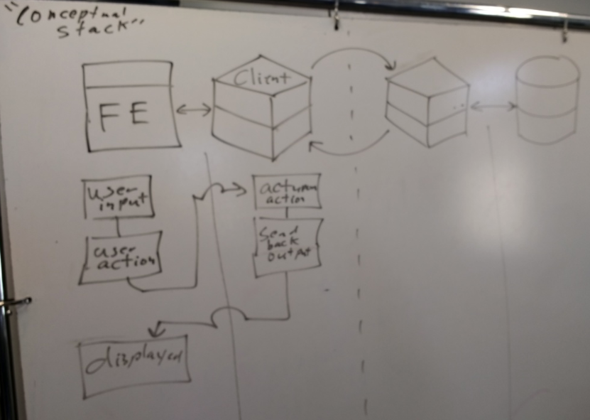
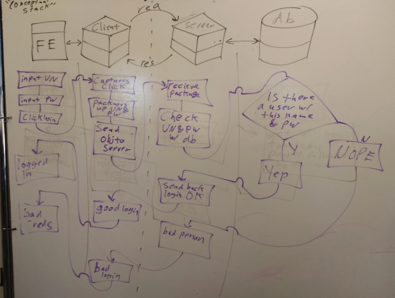

Coflax HTML/CSS Example
===

3-13-2018

Looked at conceptual stack

Front End/CLient Brain only



Full Stack Login Example



break

HTML/CSS Example
===

- index.html: content
- style.css: display

"Form Follows Function"

Step 1, basic content:

- set up basic header and body.
- template card for our 1st pony Ginuwine w/ image and list of favorite snacks
- included other pony cards based on template

Step 2, Basic styling:

- add 'style.css'
- link it into the HTML
- style the whole page
- style cards by class

```
.ponyCard{
  width: 30%;
  background-color: #ffffff;
  font-family: arial;
  border-width: 3px;
  border-color: #000000;
  border-style: solid;
  border-radius: 9px;
  padding: 9px;
  float: left;
  margin: 3px;
}
```
